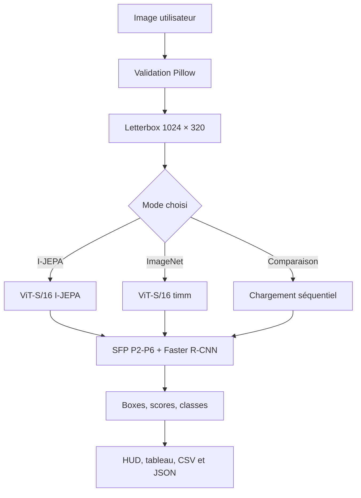

# Architecture de déploiement

Cette version sépare clairement l'interface, l'inférence, les architectures de
modèle et la gestion des checkpoints. Le fichier principal Streamlit reste
`app.py`, à la racine du dépôt.



## Responsabilités

| Fichier | Responsabilité |
|---|---|
| `app.py` | parcours utilisateur, état Streamlit, comparaison et exports |
| `config.py` | chemins, classes, résolution et métriques publiées |
| `model.py` | reconstruction exacte des ViT, SFP et Faster R-CNN |
| `inference.py` | prétraitement, inférence et remise à l'échelle des boxes |
| `checkpoint_files.py` | ordre des morceaux, tailles, fusion et SHA-256 |
| `visualization.py` | image annotée et registre des détections |
| `prepare_checkpoint.py` | conversion Colab vers le format de déploiement |
| `validate_deployment.py` | test final des deux checkpoints avant GitHub |

## Contrats techniques

- Python 3.12 et roues PyTorch CPU 2.11 / torchvision 0.26.
- Entrée du détecteur : image RGB avec letterbox exacte 1024 × 320.
- Chargement `strict=True` : aucune clé manquante ou inattendue n'est acceptée.
- Un manifeste distinct par modèle fixe l'ordre, la taille et le SHA-256.
- Les fichiers de poids sont découpés à 20 MiB pour l'interface web GitHub.
- En comparaison, un seul détecteur réside à la fois dans la mémoire applicative.
- Aucun téléchargement de poids n'est effectué au démarrage de Streamlit.

## Structure du dépôt final

```text
.
├── app.py
├── config.py
├── model.py
├── inference.py
├── checkpoint_files.py
├── visualization.py
├── ui.py
├── style.css
├── requirements.txt
├── validate_deployment.py
├── .streamlit/
│   └── config.toml
└── models/
    ├── ijepa/
    │   ├── checkpoint_manifest.json
    │   └── best_detector.pt.part001 ...
    └── imagenet/
        ├── checkpoint_manifest.json
        └── best_detector.pt.part001 ...
```

## Séquence de déploiement

1. Le notebook Colab, compatible Python 3.13, copie le projet source et convertit les deux checkpoints.
2. `validate_deployment.py` reconstitue et charge strictement chaque modèle.
3. Le notebook produit le ZIP final sans caches ni ancien ZIP imbriqué.
4. Le contenu décompressé est envoyé à la racine du dépôt GitHub.
5. Streamlit Cloud lance `app.py` avec Python 3.12 et les roues CPU épinglées.
